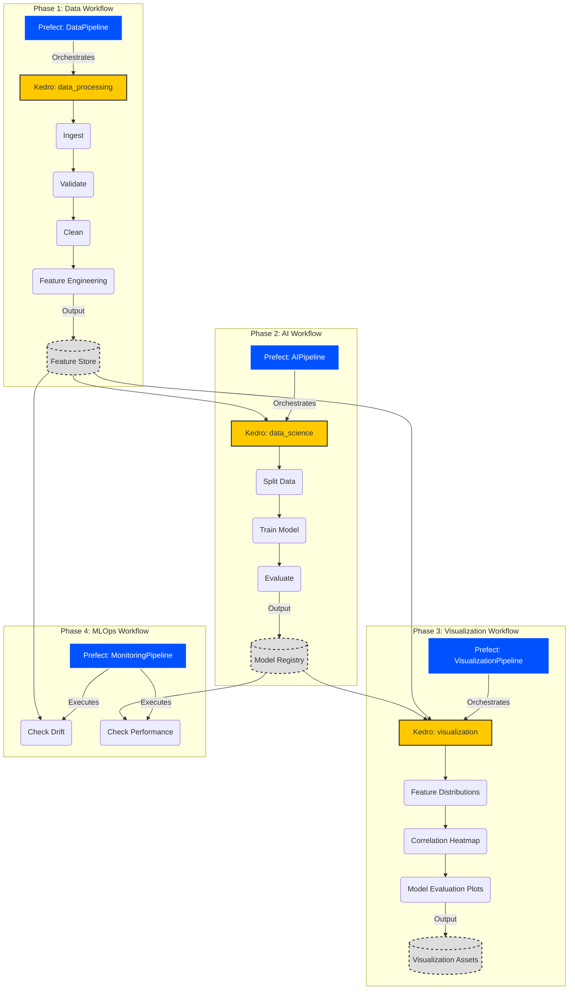

# AI Core Template 🚀

## Table of Contents

- [AI Core Template 🚀](#ai-core-template-)
  - [Table of Contents](#table-of-contents)
  - [Technical recommendations before starting](#technical-recommendations-before-starting)
    - [Core Principles](#core-principles)
    - [Why UV?](#why-uv)
    - [Command Execution Patterns](#command-execution-patterns)
      - [✅ Recommended: Direct UV Execution](#-recommended-direct-uv-execution)
      - [⚠️ Alternative: Manual Environment Activation](#️-alternative-manual-environment-activation)
      - [❌ Anti-Pattern: Direct Commands Without UV](#-anti-pattern-direct-commands-without-uv)
    - [Dependency Installation Best Practices](#dependency-installation-best-practices)
      - [Installing Project Dependencies](#installing-project-dependencies)
      - [Understanding UV's Dependency Management](#understanding-uvs-dependency-management)
    - [Quick Reference Table](#quick-reference-table)
    - [Environment Setup Workflow](#environment-setup-workflow)
    - [Common Issues and Solutions](#common-issues-and-solutions)
    - [Best Practices Summary](#best-practices-summary)
  - [Process to create a new AI Core](#process-to-create-a-new-ai-core)
    - [Phase 1: Initialization](#phase-1-initialization)
      - [Method 1: Use GitHub Template (Recommended)](#method-1-use-github-template-recommended)
      - [Method 2: Use Creation Script](#method-2-use-creation-script)
      - [Important: Post-Creation Configuration](#important-post-creation-configuration)
    - [Phase 2: Customize for Your Use Case](#phase-2-customize-for-your-use-case)
      - [Step 1: Update Configuration](#step-1-update-configuration)
      - [Step 2: Implement Custom Tasks](#step-2-implement-custom-tasks)
      - [Step 3: Add Custom Model](#step-3-add-custom-model)
      - [Step 4: Test Your Pipeline](#step-4-test-your-pipeline)
      - [Step 5: Test Prefect Workflows](#step-5-test-prefect-workflows)
      - [Step 6: Update documentation](#step-6-update-documentation)
    - [Phase 3: Deploy to Production](#phase-3-deploy-to-production)
      - [Option 1: Local Deployment](#option-1-local-deployment)
      - [Option 2: Docker Deployment \[TODO\]](#option-2-docker-deployment-todo)
      - [Option 3: Kubernetes Deployment \[TODO\]](#option-3-kubernetes-deployment-todo)
    - [Phase 4: Monitor and Maintain](#phase-4-monitor-and-maintain)
      - [View Prefect UI](#view-prefect-ui)
      - [Check Monitoring Metrics](#check-monitoring-metrics)
  - [MLflow Experiment Tracking](#mlflow-experiment-tracking)
    - [MLflow Files](#mlflow-files)
    - [Setup After Cloning](#setup-after-cloning)
    - [Features](#features)
    - [Configuration](#configuration)
    - [Loading Models from Registry](#loading-models-from-registry)
  - [Data Validation \& Quality](#data-validation--quality)
  - [Hybrid Architecture: Prefect + Kedro](#hybrid-architecture-prefect--kedro)
    - [Project Structure](#project-structure)
    - [Standardized Datasets](#standardized-datasets)
    - [System Architecture](#system-architecture)
    - [Running Pipelines](#running-pipelines)
      - [1. Via Prefect (Recommended for Production)](#1-via-prefect-recommended-for-production)
      - [2. Via Kedro (Recommended for Development)](#2-via-kedro-recommended-for-development)
    - [Visualizing Pipelines](#visualizing-pipelines)
    - [Configuration](#configuration-1)
    - [Adding New Pipelines](#adding-new-pipelines)
    - [Feast Feature Store](#feast-feature-store)
      - [Feature Store Structure](#feature-store-structure)
      - [Usage](#usage)
  - [Setup Phases](#setup-phases)
    - [Phase 1: Customize for Your Use Case](#phase-1-customize-for-your-use-case)
      - [Step 1: Update Configuration](#step-1-update-configuration-1)
      - [Step 2: Implement Custom Tasks](#step-2-implement-custom-tasks-1)
      - [Step 3: Add Custom Model](#step-3-add-custom-model-1)
      - [Step 4: Test Your Pipeline](#step-4-test-your-pipeline-1)
      - [Step 5: Test Prefect Workflows](#step-5-test-prefect-workflows-1)
    - [Phase 2: Deploy to Production](#phase-2-deploy-to-production)
      - [Option 1: Local Deployment](#option-1-local-deployment-1)
      - [Option 2: Docker Deployment \[TODO\]](#option-2-docker-deployment-todo-1)
      - [Option 3: Kubernetes Deployment \[TODO\]](#option-3-kubernetes-deployment-todo-1)
    - [Phase 3: Monitor and Maintain](#phase-3-monitor-and-maintain)
      - [View Prefect UI](#view-prefect-ui-1)
      - [Check Monitoring Metrics](#check-monitoring-metrics-1)
      - [Update Pipeline](#update-pipeline)

## Technical recommendations before starting

This project uses **[uv](https://docs.astral.sh/uv/)** as its primary package and environment manager for superior performance and dependency resolution. All commands in this README assume you're using `uv` properly.

### Core Principles

**✅ ALWAYS use `uv run` to execute commands** (kedro, streamlit, mlflow, pytest, python scripts, etc.)

**❌ AVOID activating the virtual environment manually** unless you have a specific reason

### Why UV?

- **10-100x faster** than pip for dependency resolution and installation
- **Consistent environments** across all team members
- **Built-in project management** without needing separate virtualenv tools
- **Automatic environment activation** via `uv run`

---

### Command Execution Patterns

#### ✅ Recommended: Direct UV Execution

```bash
# Run Kedro pipelines
uv run kedro run --pipeline=data_processing
uv run kedro viz

# Run Streamlit apps
uv run streamlit run app/main.py

# Start MLflow server
uv run mlflow server --host 127.0.0.1 --port 5000

# Run tests
uv run pytest tests/unit/ -v

# Execute Python scripts
uv run python scripts/check_metrics.py --pipeline customer-churn --days 7

# Run Prefect commands
uv run prefect server start
uv run prefect worker start -p "aicore-pool"
```

#### ⚠️ Alternative: Manual Environment Activation

Only use this if you need to run multiple commands in succession:

```bash
# Activate the virtual environment (created by uv sync)
source .venv/bin/activate  # On Unix/macOS
# or
.venv\Scripts\activate     # On Windows

# Now you can run commands without 'uv run' prefix
kedro run --pipeline=data_processing
streamlit run app/main.py
pytest tests/

# Remember to deactivate when done
deactivate
```

#### ❌ Anti-Pattern: Direct Commands Without UV

```bash
# DON'T DO THIS - bypasses uv environment management
kedro run                    # ❌ May use wrong Python/packages
streamlit run app/main.py    # ❌ Dependencies might not match
pytest tests/                # ❌ Unpredictable behavior
```

---

### Dependency Installation Best Practices

#### Installing Project Dependencies

```bash
# ✅ RECOMMENDED: Sync all dependencies (respects pyproject.toml and uv.lock)
uv sync

# ✅ RECOMMENDED: Install with hardware acceleration
uv sync --extra mps   # Apple Silicon (M1/M2/M3)
uv sync --extra cuda  # NVIDIA GPUs
uv sync --extra xpu   # Intel Arc GPUs

# ✅ Install additional packages (automatically updates pyproject.toml)
uv add package-name
uv add --dev package-name  # Development dependency

# ❌ AVOID: Using pip directly
pip install -r requirements.txt  # Bypasses uv's lock file and benefits
```

#### Understanding UV's Dependency Management

- **`uv sync`**: Installs/syncs dependencies from `pyproject.toml` and `uv.lock`
- **`uv add package`**: Adds package to `pyproject.toml` and installs it
- **`uv pip install`**: Lower-level command, prefer `uv sync` or `uv add`
- **`uv run`**: Automatically ensures environment is synced before running

---

### Quick Reference Table

| Task | ✅ Correct Command | ❌ Incorrect Command |
|------|-------------------|---------------------|
| Install dependencies | `uv sync` | `pip install -r requirements.txt` |
| Add new package | `uv add pandas` | `pip install pandas` |
| Run Kedro pipeline | `uv run kedro run` | `kedro run` |
| Start Streamlit | `uv run streamlit run app/main.py` | `streamlit run app/main.py` |
| Run tests | `uv run pytest tests/` | `pytest tests/` |
| Start MLflow | `uv run mlflow server` | `mlflow server` |
| Execute Python script | `uv run python script.py` | `python script.py` |

---

### Environment Setup Workflow

```bash
# 1. Clone the repository
git clone https://github.com/YOUR-USERNAME/ai-core-template.git
cd ai-core-template

# 2. Install dependencies with hardware acceleration
uv sync --extra mps   # or --extra cuda, --extra xpu

# 3. Set up environment variables
cp .env.example .env
# Edit .env with your actual values

# 4. Initialize Feature Store
cd feature_repo
uv run feast apply
cd ..

# 5. Run your first pipeline
uv run kedro run --pipeline=data_processing

# 6. Visualize pipelines
uv run kedro viz
```

---

### Common Issues and Solutions

**Issue**: "Command not found" error when running `kedro`, `streamlit`, etc.

**Solution**: Always prefix with `uv run`, or activate the environment first with `source .venv/bin/activate`

---

**Issue**: Dependencies seem outdated or mismatched

**Solution**: Re-sync the environment:

```bash
uv sync --refresh
```

---

**Issue**: Need to use a different Python version

**Solution**: UV can manage Python versions:

```bash
uv python install 3.11
uv python pin 3.11
uv sync
```

---

### Best Practices Summary

1. **Always use `uv run`** for executing commands
2. **Use `uv sync`** to install/update dependencies
3. **Use `uv add`** to add new packages
4. **Commit `uv.lock`** to version control for reproducible builds
5. **Never use bare `pip install`** - it bypasses uv's dependency resolution

---

## Process to create a new AI Core

### Phase 1: Initialization

#### Method 1: Use GitHub Template (Recommended)

1. **Go to your template repository on GitHub**
   - Navigate to: `https://github.com/YOUR-USERNAME/ai-core-template`

2. **Click "Use this template" button** (green button at top)

3. **Fill in new repository details:**
   - Repository name: `fraud-detection-ai-core`
   - Description: "Fraud detection AI pipeline"
   - Choose Public/Private
   - Click "Create repository from template"

4. **Clone your new repository:**

```bash
git clone https://github.com/YOUR-USERNAME/fraud-detection-ai-core.git
cd fraud-detection-ai-core
```

#### Method 2: Use Creation Script

We provide a script to automate the creation of a new AI Core.

**Make it executable and use it:**

```bash
chmod +x scripts/create_new_core.py

# Create new AI Core
python scripts/create_new_core.py \
  --name customer-churn-prediction \
  --industry retail \
  --output-dir ~/projects/
```

#### Important: Post-Creation Configuration

After creating a new AI Core (whether via GitHub template or script), verify the following:

1. **Package Name Configuration** (`pyproject.toml`):
   - Ensure `package_name` matches your actual package directory name
   - The script automatically updates this, but verify it's correct:

   ```toml
   [tool.kedro]
   package_name = "customer_churn_prediction"  # Should match src/<package_name>
   aicore_name = "customer-churn-prediction"
   kedro_init_version = "1.0.0"
   ```

2. **Import Paths** (`pipeline_registry.py`):
   - Update all imports to use the new package name:

   ```python
   # Before (template):
   from aicore.pipelines import data_processing, data_science, visualization
   
   # After (your AI Core):
   from customer_churn_prediction.pipelines import data_processing, data_science, visualization
   ```

3. **Verify Directory Structure**:

   ```bash
   # Your package directory should match package_name
   src/
   └── customer_churn_prediction/  # Must match package_name in pyproject.toml
       ├── __init__.py
       ├── pipeline_registry.py
       └── pipelines/
   ```

4. **Logging Configuration** (`conf/base/logging.yml`):
   - Update the logger name to match your package name:

   ```yaml
   loggers:
     customer_churn_prediction:  # Rename from 'aicore_template'
       level: INFO
       handlers: [console, rich, info_file_handler, error_file_handler]
       propagate: no
   ```

> **Note**: The `create_new_core.py` script handles these updates automatically. If you used the GitHub template method, you'll need to update these manually.

### Phase 2: Customize for Your Use Case

#### Step 1: Update Configuration

```bash
cd customer-churn-prediction

# Edit the Prefect orchestration configuration
nano configs/project_config.yaml

# Edit Kedro pipeline parameters
nano conf/base/parameters.yml
```

Update with your specific requirements:

- **Prefect Config** (`configs/project_config.yaml`): Orchestration settings, deployment configuration, work pools
- **Kedro Parameters** (`conf/base/parameters.yml`): Data sources, model parameters, pipeline-specific settings

Customise logging to `conf/base/logging.yml`

```bash
export KEDRO_LOGGING_CONFIG=conf/base/logging.yml
```

#### Step 2: Implement Custom Tasks

**Example: Add custom feature engineering task**

```bash
# Edit src/tasks/data/features.py
nano src/tasks/data/features.py
```

```python
from prefect import task
import pandas as pd

@task(name="engineer-features")
def engineer_features(df: pd.DataFrame, feature_config: dict) -> pd.DataFrame:
    """Custom feature engineering for your use case"""
    
    # Add your custom features here
    if 'customer_lifetime_value' in feature_config:
        df['clv'] = df['total_spent'] / df['months_active']
    
    if 'purchase_frequency' in feature_config:
        df['purchase_freq'] = df['num_purchases'] / df['months_active']
    
    # Add domain-specific features
    df['is_high_value'] = (df['clv'] > df['clv'].quantile(0.75)).astype(int)
    
    return df
```

#### Step 3: Add Custom Model

1. **Define the model training node:**

```bash
# Edit src/ai_core/pipelines/data_science/nodes.py
nano src/ai_core/pipelines/data_science/nodes.py
```

```python
from sklearn.ensemble import RandomForestClassifier
import pandas as pd

def train_custom_model(X_train: pd.DataFrame, y_train: pd.Series, parameters: dict) -> RandomForestClassifier:
    """Train your custom model"""
    model = RandomForestClassifier(
        n_estimators=parameters.get('n_estimators', 100),
        max_depth=parameters.get('max_depth', 10),
        random_state=42
    )
    model.fit(X_train, y_train)
    return model
```

1. **Update the pipeline definition:**

```bash
# Edit src/ai_core/pipelines/data_science/pipeline.py
nano src/ai_core/pipelines/data_science/pipeline.py
```

```python
from kedro.pipeline import Pipeline, node, pipeline
from .nodes import train_custom_model, evaluate_model, split_data

def create_pipeline(**kwargs) -> Pipeline:
    return pipeline(
        [
            node(
                func=split_data,
                inputs=["features_data", "params:model_options"],
                outputs=["X_train", "X_test", "y_train", "y_test"],
                name="split_data_node",
            ),
            node(
                func=train_custom_model,
                inputs=["X_train", "y_train", "params:model_options"],
                outputs="regressor",
                name="train_custom_model_node",
            ),
            node(
                func=evaluate_model,
                inputs=["regressor", "X_test", "y_test"],
                outputs=None,
                name="evaluate_model_node",
            ),
        ]
    )
```

#### Step 4: Test Your Pipeline

```bash
# Install dependencies
python -m venv venv
source venv/bin/activate
pip install -r requirements.txt

# Set up environment variables
cp .env.example .env
# Edit .env with your actual values

# Run unit tests
pytest tests/unit/ -v

# Run integration tests
pytest tests/integration/ -v

# Run the data processing pipeline
kedro run --pipeline data_processing

# Run the sentiment analysis pipeline
kedro run --pipeline sentiment_analysis

# Run the topic modeling pipeline
kedro run --pipeline topic_modeling

# Run the visualization pipeline
kedro run --pipeline visualization

# Run the monitoring pipeline
kedro run --pipeline monitoring

# Run the full default pipeline (all pipelines together)
kedro run

# Visualize your pipelines in browser
kedro viz
```

#### Step 5: Test Prefect Workflows

```bash
# Run individual pipelines
python -c "from src.prefect_orchestration.data_pipeline import run_pipeline; from src.utils.config_loader import load_config; run_pipeline(load_config('configs/project_config.yaml'))"

python -c "from src.prefect_orchestration.ai_pipeline import run_pipeline; from src.utils.config_loader import load_config; run_pipeline(load_config('configs/project_config.yaml'))"

python -c "from src.prefect_orchestration.visualization_pipeline import run_pipeline; from src.utils.config_loader import load_config; run_pipeline(load_config('configs/project_config.yaml'))"

python -c "from src.prefect_orchestration.monitoring_pipeline import run_pipeline; from src.utils.config_loader import load_config; run_pipeline(load_config('configs/project_config.yaml'))"

# Run master pipeline (orchestrates all pipelines)
python -c "from src.prefect_orchestration.run_all_pipelines import run_complete_pipeline; from src.utils.config_loader import load_config; run_complete_pipeline(load_config('configs/project_config.yaml'))"
```

2. Update the two main markdown documents in the `docs/` folder to specify the AI Core's business and technical requirements:

- **`docs/ai_product_canvas.md`**: Provides the high-level business goals and product requirements.
  - **Mandatory Sections**:
    - Section 1: AI Core Overview
    - Section 2: Problem Definition
    - Section 3: Hypothesis & Testing Strategy
    - Section 4: Solution Design
    - Section 5: Data
    - Section 6: Actors & Stakeholders
    - Section 7: Actions & Campaigns
    - Section 8: KPIs & Evaluation
    - Section 9: Value & Risk
    - Section 10: Theoretical Foundations of the AI Core
    - Section 11: Data Architecture & Engineering
    - Section 12: Impact & Measurement
- **`docs/technical_design.md`**: Provides the detailed technical architecture and design decisions.

### Phase 3: Deploy to Production

#### Option 1: Local Deployment

```bash
# Configure Prefect to communicate with the server
prefect config set PREFECT_API_URL=http://127.0.0.1:4200/api

# Start Prefect server
prefect server start

# Start Prefect worker (in a new terminal)
prefect worker start -p "aicore-pool"

# Register deployments (run the orchestration scripts)
python src/prefect_orchestration/data_pipeline.py
python src/prefect_orchestration/ai_pipeline.py
python src/prefect_orchestration/visualization_pipeline.py
python src/prefect_orchestration/monitoring_pipeline.py

# Register master pipeline deployment
python src/prefect_orchestration/run_all_pipelines.py

# List available deployments    
prefect deployment ls

# Trigger individual pipeline deployments
prefect deployment run 'aicore-data-flow/voice-of-customer-data'
prefect deployment run 'aicore-ai-flow/voice-of-customer-ai'
prefect deployment run 'aicore-visualization-flow/voice-of-customer-visualization'
prefect deployment run 'aicore-monitoring-flow/voice-of-customer-monitoring'

# Trigger master pipeline deployment (runs all pipelines in sequence)
prefect deployment run 'aicore-complete-flow/aicore-master'
```

#### Option 2: Docker Deployment [TODO]

#### Option 3: Kubernetes Deployment [TODO]

### Phase 4: Monitor and Maintain

#### View Prefect UI

```bash
# Access Prefect UI
open http://localhost:4200

# Monitor:
# - Flow runs
# - Task execution times
# - Failures and retries
# - Logs
```

#### Check Monitoring Metrics

```bash
# Query metrics database
python scripts/check_metrics.py --pipeline customer-churn --days 7

# View drift reports
cat logs/drift_reports/latest.json
```

## MLflow Experiment Tracking

This AI Core integrates with **MLflow** for experiment tracking, model versioning, and monitoring metrics.

### MLflow Files

When cloning or creating a new AI Core, the following MLflow files are included:

| File | Purpose |
|------|---------|
| `src/utils/mlflow_tracking.py` | Utility module for MLflow setup, run management, and Prefect linking |
| `conf/local/mlflow.yml` | Local MLflow config (credentials, custom tracking URI) |
| `conf/base/parameters.yml` | MLflow settings under `mlops:` section |

### Setup After Cloning

> **Note**: All commands should be run from the root of the AI Core folder.

```bash
# 1. The MLflow tracking utility is already included in src/utils/mlflow_tracking.py

# 2. Configure your MLflow tracking URI in conf/base/parameters.yml
# Default is http://localhost:5000

# 3. (Optional) Add credentials to conf/local/mlflow.yml for remote servers
# Note: conf/local/ is gitignored and should NOT be committed

# 4. Start local MLflow server
# This command should be run from the root of your AI Core folder.
uv run mlflow server --host 127.0.0.1 --port 5000

# 5. Run your pipeline - metrics will be logged automatically
uv run kedro run --pipeline=monitoring
```

### Features

- **Experiment Tracking**: All pipeline runs log parameters, metrics, and artifacts
- **Model Registry**: Trained models are versioned and can be promoted through stages
- **Prefect Integration**: Bi-directional linking between Prefect flows and MLflow runs

### Configuration

MLflow settings are in `conf/base/parameters.yml`:

```yaml
mlops:
  tracking_uri: "http://localhost:5000"
  experiment_name: "my_experiment"
  log_monitoring_metrics: true
  link_prefect_runs: true
  model_registry:
    enabled: true
    auto_register: true
```

### Loading Models from Registry

```python
import mlflow

# Load production model
model = mlflow.sklearn.load_model("models:/regressor/Production")

# Load specific version
model = mlflow.sklearn.load_model("models:/regressor/3")
```

## Data Validation & Quality

This project strictly adheres to the "Global Architectural Invariants" for AI Cores, enforcing data validation and type safety at every step.

- **Pydantic**: Used for strict type validation of all configuration objects (e.g., pipeline parameters, model hyperparameters).
- **Pandera**: Used for runtime validation of DataFrames. All Kedro nodes are decorated with `@pa.check_io` or `@pa.check_output` to ensure data integrity (schema, data types, null checks) before and after processing.

## Hybrid Architecture: Prefect + Kedro

This template combines the best of both worlds:

- **Prefect**: Orchestration, scheduling, observability, and deployment.
- **Kedro**: Data and AI pipeline definition, reproducibility, and visualization.

### Project Structure

The project follows a hybrid structure:

- `src/prefect_orchestration/`: Prefect flows that orchestrate Kedro pipelines.
- `src/core/`: Base classes for pipeline architecture (`KedroPipeline`).
- `src/ai_core/`: Kedro project source code (pipelines, nodes).
- `conf/`: Kedro configuration (catalog, parameters, logging).
- `configs/`: Prefect orchestration configuration (`project_config.yaml`).
- `data/`: Data storage.
- `app/`: Streamlit applications.

### Standardized Datasets

The template includes specialized Kedro datasets in `src/aicore/datasets/` for high-performance data IO:

- **PolarsDeltaDataset**: Handles "PurePosixPath" compatibility for Delta Lake, ensuring seamless integration between Polars and Delta tables.
- **CloudPickleDataset**: Serializes complex ML models (like BTYD or Transformers) that standard pickle cannot handle due to complex dependencies or lambda functions.

### System Architecture



### Running Pipelines

You can run pipelines in two ways:

#### 1. Via Prefect (Recommended for Production)

This runs the Prefect flow, which in turn executes the Kedro pipeline.

```bash
# Run Data Pipeline
python -m src.prefect_orchestration.data_pipeline

# Run AI Pipeline
python -m src.prefect_orchestration.ai_pipeline

# Run Visualization Pipeline
python -m src.prefect_orchestration.visualization_pipeline
```

#### 2. Via Kedro (Recommended for Development)

This runs the Kedro pipeline directly, useful for debugging nodes.

```bash
kedro run --pipeline=data_processing
kedro run --pipeline=data_science
kedro run --pipeline=visualization
```

### Visualizing Pipelines

To visualize your Kedro pipelines:

```bash
kedro viz
```

### Configuration

The project uses a clear separation of concerns for configuration:

- **Prefect Configuration**: `configs/project_config.yaml` - Orchestration settings, deployments, work pools, logging.
- **Data Catalog**: `conf/base/catalog.yml` - Define your datasets (Kedro).
- **Parameters**: `conf/base/parameters.yml` - Define pipeline parameters (Kedro).
- **Logging**: `conf/base/logging.yml` - Kedro logging configuration.

### Adding New Pipelines

1. Create a new directory in `src/aicore/pipelines/`.
2. Add `nodes.py` and `pipeline.py`.
3. Register the pipeline in `src/aicore/pipeline_registry.py`.

### Feast Feature Store

This AI Core integrates with **Feast** for feature management. The `data_processing` pipeline's final node registers features to Feast, making them available for downstream models.

#### Feature Store Structure

```
feature_repo/
├── feature_store.yaml   # Feast configuration
├── entities.py          # Entity definitions (customer_id)
└── features.py          # FeatureView definitions
```

#### Usage

```bash
# Apply feature definitions to registry
feast -c feature_repo apply

# Verify registered features
feast -c feature_repo registry-dump

# Query features programmatically
from feast import FeatureStore
store = FeatureStore("feature_repo")
print(store.list_feature_views())
```

Features are automatically written to Delta tables and registered when running the pipeline:

```bash
kedro run --pipeline=data_processing
```

---

## Setup Phases

### Phase 1: Customize for Your Use Case

#### Step 1: Update Configuration

```bash
cd ai_core_template

# Edit the Prefect orchestration configuration
nano configs/project_config.yaml

# Edit Kedro pipeline parameters
nano conf/base/parameters.yml
```

Update with your specific requirements:

- **Prefect Config** (`configs/project_config.yaml`): Orchestration settings, deployment configuration, work pools
- **Kedro Parameters** (`conf/base/parameters.yml`): Data sources, model parameters, pipeline-specific settings

Customise logging to `conf/base/logging.yml`

```bash
export KEDRO_LOGGING_CONFIG=conf/base/logging.yml
```

#### Step 2: Implement Custom Tasks

**Example: Add custom feature engineering task**

```bash
# Edit src/tasks/data/features.py
nano src/tasks/data/features.py
```

```python
from prefect import task
import pandas as pd

@task(name="engineer-features")
def engineer_features(df: pd.DataFrame, feature_config: dict) -> pd.DataFrame:
    """Custom feature engineering for your use case"""
    
    # Add your custom features here
    if 'customer_lifetime_value' in feature_config:
        df['clv'] = df['total_spent'] / df['months_active']
    
    if 'purchase_frequency' in feature_config:
        df['purchase_freq'] = df['num_purchases'] / df['months_active']
    
    # Add domain-specific features
    df['is_high_value'] = (df['clv'] > df['clv'].quantile(0.75)).astype(int)
    
    return df
```

#### Step 3: Add Custom Model

1. **Define the model training node:**

```bash
# Edit src/aicore/pipelines/data_science/nodes.py
nano src/aicore/pipelines/data_science/nodes.py
```

```python
from sklearn.ensemble import RandomForestClassifier
import pandas as pd

def train_custom_model(X_train: pd.DataFrame, y_train: pd.Series, parameters: dict) -> RandomForestClassifier:
    """Train your custom model"""
    model = RandomForestClassifier(
        n_estimators=parameters.get('n_estimators', 100),
        max_depth=parameters.get('max_depth', 10),
        random_state=42
    )
    model.fit(X_train, y_train)
    return model
```

1. **Update the pipeline definition:**

```bash
# Edit src/aicore/pipelines/data_science/pipeline.py
nano src/aicore/pipelines/data_science/pipeline.py
```

```python
from kedro.pipeline import Pipeline, node, pipeline
from .nodes import train_custom_model, evaluate_model, split_data

def create_pipeline(**kwargs) -> Pipeline:
    return pipeline(
        [
            node(
                func=split_data,
                inputs=["features_data", "params:model_options"],
                outputs=["X_train", "X_test", "y_train", "y_test"],
                name="split_data_node",
            ),
            node(
                func=train_custom_model,
                inputs=["X_train", "y_train", "params:model_options"],
                outputs="regressor",
                name="train_custom_model_node",
            ),
            node(
                func=evaluate_model,
                inputs=["regressor", "X_test", "y_test"],
                outputs=None,
                name="evaluate_model_node",
            ),
        ]
    )
```

#### Step 4: Test Your Pipeline

```bash
# Install dependencies with uv
uv sync

# Hardware Acceleration (Recommended)
# Enable GPU support for your specific hardware:
uv sync --extra mps   # Apple Silicon (M1/M2/M3) - REQUIRED for local Mac dev
uv sync --extra cuda  # NVIDIA GPUs (Linux/Windows)
uv sync --extra xpu   # Intel Arc / Data Center GPUs
# Note: failure to select an accelerator may result in CPU-only fallbacks with warnings.

# Activate environment
source .venv/bin/activate

# Set up environment variables
cp .env.example .env
# Edit .env with your actual values (OPENAI_API_KEY, GROQ_API_KEY, etc.)

# Initialize Feature Store (Feast)
cd feature_repo
feast apply
cd ..

# Run unit tests
pytest tests/unit/ -v

# Run integration tests
pytest tests/integration/ -v

# Run the data processing pipeline
kedro run --pipeline data_processing

# Run the data science pipeline
kedro run --pipeline data_science

# Run the visualization pipeline
kedro run --pipeline visualization

# Run the monitoring pipeline
kedro run --pipeline monitoring

# [Optional] Run topic modeling and sentiment analysis pipelines
kedro run --pipeline topic_modeling
kedro run --pipeline sentiment_analysis

# Run the full default pipeline (all pipelines together)
kedro run

# Visualize your pipelines in browser
kedro viz
```

#### Step 5: Test Prefect Workflows

```bash
# Run individual pipelines
python -c "from src.prefect_orchestration.data_pipeline import run_pipeline; from src.utils.config_loader import load_config; run_pipeline(load_config('configs/project_config.yaml'))"

python -c "from src.prefect_orchestration.ai_pipeline import run_pipeline; from src.utils.config_loader import load_config; run_pipeline(load_config('configs/project_config.yaml'))"

python -c "from src.prefect_orchestration.visualization_pipeline import run_pipeline; from src.utils.config_loader import load_config; run_pipeline(load_config('configs/project_config.yaml'))"

python -c "from src.prefect_orchestration.monitoring_pipeline import run_pipeline; from src.utils.config_loader import load_config; run_pipeline(load_config('configs/project_config.yaml'))"

# Run master pipeline (orchestrates all pipelines)
python -c "from src.prefect_orchestration.run_all_pipelines import run_complete_pipeline; from src.utils.config_loader import load_config; run_complete_pipeline(load_config('configs/project_config.yaml'))"
```

### Phase 2: Deploy to Production

#### Option 1: Local Deployment

```bash
# Configure Prefect to communicate with the server
prefect config set PREFECT_API_URL=http://127.0.0.1:4200/api

# Start Prefect server
prefect server start

# Start Prefect worker (in a new terminal)
prefect worker start -p "aicore-pool"

# Register deployments (run the orchestration scripts)
python src/prefect_orchestration/data_pipeline.py
python src/prefect_orchestration/ai_pipeline.py
python src/prefect_orchestration/visualization_pipeline.py
python src/prefect_orchestration/monitoring_pipeline.py

# Register master pipeline deployment
python src/prefect_orchestration/run_all_pipelines.py

# List available deployments    
prefect deployment ls

# Trigger individual pipeline deployments
prefect deployment run 'aicore-data-flow/voice-of-customer-data'
prefect deployment run 'aicore-ai-flow/voice-of-customer-ai'
prefect deployment run 'aicore-visualization-flow/voice-of-customer-visualization'
prefect deployment run 'aicore-monitoring-flow/voice-of-customer-monitoring'

# Trigger master pipeline deployment (runs all pipelines in sequence)
prefect deployment run 'aicore-complete-flow/aicore-master'
```

#### Option 2: Docker Deployment [TODO]

#### Option 3: Kubernetes Deployment [TODO]

### Phase 3: Monitor and Maintain

#### View Prefect UI

```bash
# Access Prefect UI
open http://localhost:4200

# Monitor:
# - Flow runs
# - Task execution times
# - Failures and retries
# - Logs
```

#### Check Monitoring Metrics

```bash
# Query metrics database
python scripts/check_metrics.py --pipeline customer-churn --days 7

# View drift reports
cat logs/drift_reports/latest.json
```

#### Update Pipeline

```bash
# Make changes to your code
git add src/
git commit -m "Update feature engineering logic"
git push

# Re-deploy using prefect.yaml
prefect deploy --all
```