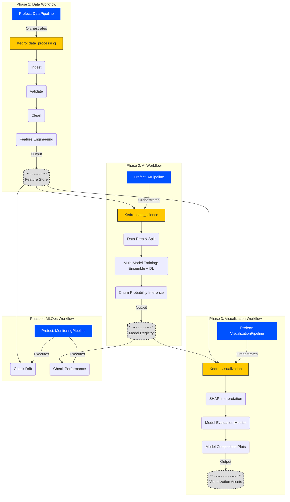

# Technical Design Document

**AI Core:** `Churn Forecasting`  
**Industry:** `Media & Entertainment`  
**Version:** `1.0.0`  
**Last Updated:** `2026-01-21`  
**Author:** `AI Cores Team`

---

## 1. System Architecture Overview

### 1.1 High-Level Architecture

```text
┌─────────────────────────────────────────────────────────────────────┐
│                         PRESENTATION LAYER                           │
│  ┌──────────────────────────────────────────────────────────────┐  │
│  │  Streamlit Dashboard (app/)                                   │  │
│  │  - Executive KPIs  - Interactive Visualizations               │  │
│  │  - User Filters    - Explainability Views                     │  │
│  └──────────────────────────────────────────────────────────────┘  │
└─────────────────────────────────────────────────────────────────────┘
                                    ▼
┌─────────────────────────────────────────────────────────────────────┐
│                      ORCHESTRATION LAYER                             │
│  ┌──────────────────────────────────────────────────────────────┐  │
│  │  Prefect Workflows (src/prefect_orchestration/)               │  │
│  │  - Scheduled Flows  - Error Handling  - Retry Logic           │  │
│  │  - Task Monitoring  - Concurrency Control                     │  │
│  └──────────────────────────────────────────────────────────────┘  │
└─────────────────────────────────────────────────────────────────────┘
                                    ▼
┌─────────────────────────────────────────────────────────────────────┐
│                      TRANSFORMATION LAYER                            │
│  ┌──────────────────────────────────────────────────────────────┐  │
│  │  Kedro Pipelines (src/aicore/pipelines/)                      │  │
│  │                                                                │  │
│  │  ┌─────────────────┐  ┌──────────────┐  ┌─────────────────┐ │  │
│  │  │ Data Processing │→ │ Data Science │→ │  Visualization  │ │  │
│  │  │  - Ingestion    │  │  - Training  │  │  - Reporting    │ │  │
│  │  │  - Validation   │  │  - Inference │  │  - Monitoring   │ │  │
│  │  │  - Features     │  │  - Explain   │  │                 │ │  │
│  │  └─────────────────┘  └──────────────┘  └─────────────────┘ │  │
│  └──────────────────────────────────────────────────────────────┘  │
└─────────────────────────────────────────────────────────────────────┘
                                    ▼
┌─────────────────────────────────────────────────────────────────────┐
│                         DATA & STORAGE LAYER                         │
│  ┌──────────────────────────────────────────────────────────────┐  │
│  │  Feature Store (Feast)  │  Model Registry (MLflow)            │  │
│  │  Data Catalog (Kedro)   │  Object Storage (S3/Local)          │  │
│  └──────────────────────────────────────────────────────────────┘  │
└─────────────────────────────────────────────────────────────────────┘
```

### 1.2 Technology Stack

| Layer | Technology | Purpose |
|-------|-----------|---------|
| **Presentation** | Streamlit, Plotly Express | Interactive dashboards and Retention Command Center |
| **Orchestration** | Prefect 2.x/3.x | Workflow scheduling, monitoring, and error handling |
| **Transformation** | Kedro 0.19+ | Data pipeline framework and reproducibility |
| **Feature Store** | Feast 0.38+ | Feature versioning, materialization, and serving |
| **Model Registry** | MLflow | Experiment tracking, model versioning, and registry |
| **Inference & DL** | PyTorch, XGBoost | Deep Learning (CNN-BiLSTM) and Refinement models |
| **Ensemble Models** | LightGBM, CatBoost, Scikit-learn | Multi-model stack and hard/soft voting ensembles |
| **Interpretability** | SHAP, LIME | Global and local feature importance explanations |
| **Data Processing** | Polars, Numpy, Pandas | High-performance data processing and ML bridging |
| **Validation** | Pandera, Pydantic | Schema enforcement and type-safe configurations |
| **Privacy** | Presidio | Automatic PII detection and masking |

---

## 2. Key Architectural Decisions

### 2.1 Decision: Hybrid Kedro + Prefect Architecture

**Context:** Need for both reproducible data pipelines and robust workflow orchestration.

**Decision:** Use Kedro for pipeline logic and Prefect for scheduling/orchestration.

**Rationale:**

- **Kedro** provides:
  - DataCatalog pattern (single source of truth for I/O)
  - Modular pipeline structure
  - Configuration management (base/local)
  - Reproducibility and testability
  
- **Prefect** provides:
  - Distributed task execution
  - Retry logic and error handling
  - Observability and monitoring
  - Dynamic workflow generation

**Consequences:**

- ✅ Best-in-class pipeline development experience
- ✅ Production-grade orchestration capabilities
- ⚠️ Must follow "Pickling Rule": Never pass KedroContext/DataCatalog between Prefect tasks
- ⚠️ Initialize ephemeral KedroSession inside each Prefect task

**Implementation Pattern:**

```python
from prefect import task, flow
from kedro.framework.session import KedroSession

@task(retries=3, retry_delay_seconds=60)
def run_kedro_pipeline_task(pipeline_name: str):
    """Execute Kedro pipeline within Prefect task."""
    with KedroSession.create(project_path=".") as session:
        session.run(pipeline_name=pipeline_name)

@flow
def main_workflow():
    run_kedro_pipeline_task("data_processing")
    run_kedro_pipeline_task("data_science")
```

---

### 2.2 Decision: Feast for Feature Store

**Context:** Need for versioned, reproducible feature engineering with online/offline serving.

**Decision:** Integrate Feast as the feature store, materialized from final Kedro data processing nodes.

**Rationale:**

- Time-travel capabilities for point-in-time correct features
- Unified offline (training) and online (inference) feature serving
- Native integration with Polars and Delta Lake
- Open-source and cloud-agnostic

**Consequences:**

- ✅ Reproducible feature engineering
- ✅ Prevents train-serve skew
- ⚠️ Requires `feature_repo/` structure per AI Core
- ⚠️ Must materialize features from Kedro pipeline outputs

**Integration Point:**

```python
# Final node in data_processing pipeline
def materialize_to_feast(features_df: pl.DataFrame) -> None:
    """Write features to Feast feature store."""
    # Implementation in src/aicore/pipelines/data_processing/nodes.py
```

---

### 2.3 Decision: Strict Type Safety

**Context:** Need for maintainable, self-documenting code in production ML systems.

**Decision:** Mandatory type hints for all function signatures and Pydantic models for configuration.

**Rationale:**

- Early error detection during development
- Self-documenting code
- Better IDE support and autocomplete
- Easier onboarding for new team members

**Consequences:**

- ✅ Fewer runtime errors
- ✅ Better code quality
- ⚠️ Slightly more verbose code
- ⚠️ Requires team training on typing module

**Standard:**

```python
from typing import List, Dict, Optional
import polars as pl

def engineer_features(
    raw_data: pl.DataFrame,
    lookback_days: int = 90
) -> pl.DataFrame:
    """Engineer temporal features from raw data.
    
    Args:
        raw_data: Raw event data with required schema
        lookback_days: Historical window for feature calculation
        
    Returns:
        Feature DataFrame with engineered columns
    """
    # Implementation
```

---

### 2.4 Decision: Configuration-Driven Development

**Context:** Need to support multiple environments (dev, staging, prod) and prevent credential leaks.

**Decision:** Use Kedro's conf/base and conf/local pattern with strict .gitignore rules.

**Rationale:**

- Separation of defaults (base) and secrets (local)
- Environment-specific overrides
- Single source of truth for all configurations
- Built-in Kedro support

**Consequences:**

- ✅ No hardcoded credentials in code
- ✅ Easy environment switching
- ⚠️ Must educate team on base vs. local
- ⚠️ conf/local/ must be in .gitignore

**Structure:**

```
conf/
├── base/
│   ├── catalog.yml       # Data sources (no credentials)
│   ├── parameters.yml    # Model hyperparameters
│   └── logging.yml       # Logging configuration
└── local/
    ├── credentials.yml   # API keys, DB passwords (GITIGNORED)
    └── mlflow.yml        # MLflow tracking URI (GITIGNORED)
```

---

### 2.5 Decision: Domain-Specific Modeling Strategy

**Context:** The Media & Entertainment domain presents unique challenges, such as understanding complex user engagement sequences and predicting both explicit (contractual) and implicit (silent) churn. A robust modeling strategy must capture diverse behavioral patterns and provide actionable insights.

**Decision:** Employ a multi-layered modeling approach combining a Temporal Deep Learning Layer and a Static Feature Ensemble Layer. This strategy is designed to holistically capture the nuances of churn behavior in the Media & Entertainment industry.

**Rationale:**

- **Temporal Layer (CNN-BiLSTM with Multi-Head Self-Attention):** Essential for extracting patterns from sequential user engagement data (e.g., watch time, session duration trends). This allows for the detection of subtle decay in user activity over time, crucial for identifying early signs of disengagement.
- **Ensemble Layer (XGBoost, LightGBM, CatBoost, RandomForest):** Effective for leveraging static and aggregated features (e.g., tenure, device, plan tier). A soft-voting ensemble enhances predictive power, robustness, and reduces bias by combining diverse model strengths.

**Consequences:**

- ✅ **High Accuracy & Robustness:** Multi-model ensemble and deep learning capture a wide range of churn signals, leading to superior predictive performance.
- ✅ **Actionable Insights:** SHAP/LIME explainability (implemented in `nodes.py`) provides clear feature attribution, enabling targeted retention strategies for marketing and product teams.
- ✅ **Temporal Awareness:** The deep learning component specifically addresses time-series data, offering a leading indicator for churn based on engagement decay.
- ✅ **Comprehensive Churn Types:** Addresses both contractual and non-contractual churn mechanisms.
- ⚠️ **Increased Complexity:** Managing multiple model types and their respective pipelines adds to the overall system complexity.
- ⚠️ **Resource Intensive:** Training and inference for deep learning and multiple ensemble models can demand significant computational resources.

**Model Stack:**

- **Temporal Deep Learning Layer:**
  - **Model:** `ChurnCNNAttentionLSTM` (from `dl_nodes.py`)
  - **Purpose:** Captures patterns from sequential engagement streams (logins, session duration trends) to detect engagement decay.
- **Ensemble Layer (Soft-Voting Classifier):**
  - **Constituent Models:**
    - `XGBoost` (`xgb.XGBClassifier`)
    - `LightGBM` (`lgb.LGBMClassifier`)
    - `CatBoost` (`cb.CatBoostClassifier`)
    - `RandomForest` (`sklearn.ensemble.RandomForestClassifier`)
  - **Purpose:** Soft-voting combination of gradient-boosting and tree-based models for static features (Tenure, Device, Plan Tier), enhancing overall prediction accuracy and stability.

---

### 2.6 Hybrid Architecture Implementation Details

This section provides detailed implementation guidance for the Prefect + Kedro hybrid architecture.

#### **Project Structure**

The AI Core follows a hybrid structure that separates orchestration concerns from pipeline logic:

```text
ai_core_name/
├── src/
│   ├── prefect_orchestration/     # Prefect flows that orchestrate Kedro pipelines
│   │   ├── data_pipeline.py       # Data processing workflow
│   │   ├── ai_pipeline.py         # Model training workflow
│   │   ├── visualization_pipeline.py  # Reporting workflow
│   │   ├── monitoring_pipeline.py # Drift detection workflow
│   │   └── run_all_pipelines.py   # Master orchestration flow
│   ├── core/                      # Base classes for pipeline architecture
│   │   └── kedro_pipeline.py      # KedroPipeline base class
│   ├── aicore/                    # Kedro project source code
│   │   ├── pipelines/             # Pipeline modules
│   │   │   ├── data_processing/
│   │   │   ├── data_science/
│   │   │   ├── visualization/
│   │   │   └── monitoring/
│   │   ├── datasets/              # Custom Kedro datasets
│   │   │   ├── polars_delta_dataset.py
│   │   │   ├── cloudpickle_dataset.py
│   │   │   └── tensor_dataset.py
│   │   └── pipeline_registry.py   # Pipeline registration
│   └── utils/                     # Shared utilities
│       └── mlflow_tracking.py     # MLflow integration
├── conf/                          # Kedro configuration
│   ├── base/                      # Default configuration
│   │   ├── catalog.yml            # Data sources and destinations
│   │   ├── parameters.yml         # Pipeline parameters
│   │   └── logging.yml            # Logging configuration
│   └── local/                     # Local overrides (gitignored)
│       ├── credentials.yml        # Secrets
│       └── mlflow.yml             # MLflow tracking URI
├── configs/                       # Prefect orchestration configuration
│   └── project_config.yaml        # Orchestration settings, deployments, work pools
├── data/                          # Data storage (layered)
│   ├── 01_raw/                    # Raw input data
│   ├── 02_intermediate/           # Intermediate processing
│   ├── 03_primary/                # Cleaned data
│   ├── 04_feature/                # Engineered features
│   └── 05_model_input/            # Model-ready datasets
├── feature_repo/                  # Feast feature store
│   ├── feature_store.yaml         # Feast configuration
│   ├── entities.py                # Entity definitions
│   └── features.py                # FeatureView definitions
└── app/                           # Streamlit applications
    └── app.py                     # Main dashboard
```

---

#### **Standardized Datasets**

The template includes specialized Kedro datasets in `src/aicore/datasets/` for high-performance data I/O:

**1. PolarsDeltaDataset**

Handles "PurePosixPath" compatibility for Delta Lake, ensuring seamless integration between Polars and Delta tables.

```python
# Usage in catalog.yml
features_delta:
  type: aicore.datasets.polars_delta_dataset.PolarsDeltaDataset
  filepath: data/04_feature/features.delta
  write_mode: overwrite
  delta_write_options:
    schema_mode: overwrite
```

**Key Features:**

- Native Polars DataFrame support
- Delta Lake ACID transactions
- Schema evolution support
- Time-travel capabilities

**2. CloudPickleDataset**

Serializes complex ML models (like BTYD, Transformers, or custom PyTorch models) that standard pickle cannot handle due to complex dependencies or lambda functions.

```python
# Usage in catalog.yml
bg_nbd_model:
  type: aicore.datasets.cloudpickle_dataset.CloudPickleDataset
  filepath: data/06_models/bg_nbd_model.pkl
```

**Key Features:**

- Handles lambda functions and closures
- Supports complex nested objects
- Compatible with Bayesian models (PyMC, BTYD)
- Preserves model state and hyperparameters

**3. TensorDataset**

Efficiently saves and loads PyTorch Tensors, commonly used for creating sequential datasets for LSTMs or Transformers.

```python
# Usage in catalog.yml
sequential_input_tensors:
  type: aicore.datasets.tensor_dataset.TensorDataset
  filepath: data/05_model_input/sequential_tensors.pt
```

**Key Features:**

- Native PyTorch Tensor serialization
- Ideal for deep learning model inputs
- Preserves tensor shape, data type, and device

---

#### **Detailed System Architecture**

The following Mermaid diagram illustrates the four-phase workflow orchestration:



**Workflow Phases:**

1. **Phase 1 - Data Workflow:**
   - Ingests raw data from multiple sources (Engagement, Subscription, QoE)
   - Validates data quality using Pandera schemas
   - Cleans and standardizes data formats
   - Engineers features (RFM-T, Engagement Velocity, QoE Friction) and materializes to Feast

2. **Phase 2 - AI Workflow:**
   - Loads features from Feast and prepares target variables (churn indicators)
   - Splits data into stratified train/test sets
   - Trains a multi-layered model stack: Ensemble (XGB, RF, LGBM, CB) and CNN-BiLSTM
   - Generates multi-horizon churn probabilities and risk tiers
   - Registers models and explainers (SHAP/LIME) to MLflow

3. **Phase 3 - Visualization Workflow:**
   - Produces SHAP summary plots for feature interpretability
   - Computes granular evaluation metrics (AUC, Accuracy, Precision, Recall)
   - Generates model comparison visualizations to benchmark ensemble performance
   - Exports assets for the Streamlit Retention Command Center

4. **Phase 4 - MLOps Workflow:**
   - Monitors for feature and semantic drift in engagement signals
   - Tracks model performance degradation over time
   - Triggers alerts for anomalies in churn velocity or QoE spikes
   - Logs continuous metrics to MLflow for historical auditability

---

#### **Configuration & Extension**

The project uses a clear separation of concerns for configuration:

**Configuration Files:**

| File | Purpose | Scope |
|------|---------|-------|
| `configs/project_config.yaml` | Prefect orchestration settings, deployments, work pools, logging | Orchestration |
| `conf/base/catalog.yml` | Dataset definitions (inputs, outputs, models) | Data I/O |
| `conf/base/parameters.yml` | Pipeline parameters, model hyperparameters, MLflow settings | Pipeline Logic |
| `conf/base/logging.yml` | Kedro logging configuration | Observability |
| `conf/local/credentials.yml` | API keys, database passwords, cloud credentials (gitignored) | Secrets |
| `conf/local/mlflow.yml` | MLflow tracking URI, experiment names (gitignored) | MLflow Config |

**Adding New Functionality:**

**1. New Pipelines:**

```bash
# Create new pipeline directory
mkdir -p src/aicore/pipelines/my_new_pipeline

# Create nodes.py
cat > src/aicore/pipelines/my_new_pipeline/nodes.py << 'EOF'
import polars as pl

def my_transformation(input_df: pl.DataFrame) -> pl.DataFrame:
    """Custom transformation logic."""
    return input_df.with_columns(
        pl.col("value").mul(2).alias("doubled_value")
    )
EOF

# Create pipeline.py
cat > src/aicore/pipelines/my_new_pipeline/pipeline.py << 'EOF'
from kedro.pipeline import Pipeline, node, pipeline
from .nodes import my_transformation

def create_pipeline(**kwargs) -> Pipeline:
    return pipeline([
        node(
            func=my_transformation,
            inputs="input_data",
            outputs="transformed_data",
            name="transform_node"
        )
    ])
EOF

# Register in pipeline_registry.py
# Add to src/aicore/pipeline_registry.py:
# from aicore.pipelines.my_new_pipeline import create_pipeline as my_new_pipeline
# And register it in the registry dictionary
```

**2. Custom Datasets:**

```python
# Create custom dataset in src/aicore/datasets/my_dataset.py
from kedro.io import AbstractDataset
import polars as pl

class MyCustomDataset(AbstractDataset):
    def __init__(self, filepath: str, **kwargs):
        self._filepath = filepath
        
    def _load(self) -> pl.DataFrame:
        # Custom load logic
        return pl.read_parquet(self._filepath)
        
    def _save(self, data: pl.DataFrame) -> None:
        # Custom save logic
        data.write_parquet(self._filepath)
        
    def _describe(self):
        return dict(filepath=self._filepath)
```

---

#### **Feast Feature Store Integration**

This AI Core integrates with **Feast** for feature management. The `data_processing` pipeline's final node registers features to Feast, making them available for downstream models.

**Feature Store Structure:**

```text
feature_repo/
├── feature_store.yaml   # Feast configuration (offline/online stores)
├── entities.py          # Entity definitions (e.g., customer_id, subscriber_id)
└── features.py          # FeatureView definitions (feature schemas and sources)
```

**Example Entity Definition (`entities.py`):**

```python
from feast import Entity

customer = Entity(
    name="customer_id",
    description="Unique customer identifier",
    join_keys=["customer_id"]
)
```

**Example FeatureView Definition (`features.py`):**

```python
from feast import FeatureView, Field
from feast.types import Float64, Int64, String
from datetime import timedelta

customer_features = FeatureView(
    name="customer_features",
    entities=["customer_id"],
    ttl=timedelta(days=365),
    schema=[
        Field(name="tenure_days", dtype=Int64),
        Field(name="avg_session_duration", dtype=Float64),
        Field(name="engagement_score", dtype=Float64),
        Field(name="device_type", dtype=String),
    ],
    source=DeltaSource(
        path="data/04_feature/customer_features.delta",
        timestamp_field="event_timestamp"
    )
)
```

**Usage Commands:**

```bash
# Apply feature definitions to registry
feast -c feature_repo apply

# Verify registered features
feast -c feature_repo feature-views list

# Materialize features for offline training
feast -c feature_repo materialize-incremental $(date -u +"%Y-%m-%dT%H:%M:%S")

# Query features programmatically
from feast import FeatureStore

store = FeatureStore("feature_repo")
print(store.list_feature_views())

# Get historical features for training
entity_df = pl.DataFrame({
    "customer_id": [1, 2, 3],
    "event_timestamp": ["2026-01-01", "2026-01-01", "2026-01-01"]
})

training_df = store.get_historical_features(
    entity_df=entity_df,
    features=["customer_features:tenure_days", "customer_features:engagement_score"]
).to_df()
```

**Automatic Feature Materialization:**

Features are automatically written to Delta tables and registered when running the pipeline:

```bash
# Run data processing pipeline (includes Feast materialization)
uv run kedro run --pipeline=data_processing
```

**Integration in Kedro Pipeline:**

```python
# Final node in data_processing pipeline
def materialize_to_feast(features_df: pl.DataFrame) -> None:
    """Write features to Delta Lake and materialize to Feast."""
    from feast import FeatureStore
    
    # Write to Delta Lake (source for Feast)
    features_df.write_delta("data/04_feature/customer_features.delta")
    
    # Materialize to Feast
    store = FeatureStore("feature_repo")
    store.materialize_incremental(end_date=datetime.now())
```

---

## 3. Data Flow Diagram

```text
┌─────────────┐
│ Raw Sources │
│ (S3/API/DB) │
└──────┬──────┘
       │
       ▼
┌─────────────────────────────────────────────┐
│ Data Processing Pipeline                    │
│ ┌─────────────────────────────────────────┐ │
│ │ 1. Ingest & Validate (Pandera schemas)  │ │
│ │ 2. Clean & Standardize                  │ │
│ │ 3. Engineer Features (RFM, QoE, etc.)   │ │
│ │ 4. Materialize to Feast Feature Store   │ │
│ └─────────────────────────────────────────┘ │
└──────┬──────────────────────────────────────┘
       │
       ▼
┌─────────────────────────────────────────────┐
│ Data Science Pipeline                       │
│ ┌─────────────────────────────────────────┐ │
│ │ 1. Load Features from Feast             │ │
│ │ 2. Multi-Model Training (Ensemble + DL) │ │
│ │ 3. Churn Probability Inference          │ │
│ │ 4. Compute Explainability (SHAP/LIME)   │ │
│ │ 5. Register Models to MLflow            │ │
│ └─────────────────────────────────────────┘ │
└──────┬──────────────────────────────────────┘
       │
       ▼
┌─────────────────────────────────────────────┐
│ Visualization Pipeline                      │
│ ┌─────────────────────────────────────────┐ │
│ │ 1. Generate SHAP Interpretability Plots │ │
│ │ 2. Model Benchmarking & Comparison      │ │
│ │ 3. Export Assets to Dashboard Store     │ │
│ └─────────────────────────────────────────┘ │
└──────┬──────────────────────────────────────┘
       │
       ▼
┌─────────────────┐
│ Streamlit App   │
│ (Business Users)│
└─────────────────┘
```

---

## 4. Security & Compliance

### 4.1 PII Handling

- **Detection:** Automatic PII detection using Presidio
- **Masking:** De-identification before feature engineering
- **Storage:** PII never enters training datasets or feature store

### 4.2 Secrets Management

- All credentials in `conf/local/credentials.yml` (gitignored)
- Use Prefect Blocks for production secret injection
- No hardcoded API keys or passwords in code

### 4.3 Data Governance

- All datasets versioned in DataCatalog
- Audit trail via MLflow experiment tracking
- Reproducible pipelines with fixed random seeds

---

## 5. Performance & Scalability

### 5.1 Optimization Strategies

- **Vectorization:** No for-loops on DataFrames (use Polars/Pandas vector ops)
- **Caching:** Streamlit `@st.cache_resource` for models, `@st.cache_data` for DataFrames
- **Batching:** Prefect task mapping for parallel processing
- **Hardware Acceleration:** GPU support for deep learning models (CUDA/MPS/SYCL)

### 5.2 Scalability Targets

- **Data Volume:** `[e.g., 10M+ events/day]`
- **Inference Latency:** `[e.g., <100ms per prediction]`
- **Concurrent Users:** `[e.g., 50+ dashboard users]`

---

## 6. Monitoring & Observability

### 6.1 Pipeline Monitoring

- **Prefect UI:** Workflow execution status, task retries, failures
- **MLflow:** Model performance metrics, experiment tracking
- **Logging:** Centralized logging via Python `logging` module

### 6.2 Model Monitoring

- **Drift Detection:** Feature distribution monitoring
- **Performance Tracking:** KPI dashboards in Streamlit
- **Alerting:** Prefect notifications on pipeline failures

---

## 7. Deployment Topology

```
Development Environment:
- Local Kedro execution
- Local MLflow server
- Streamlit dev server

Production Environment:
- Prefect Cloud/Server for orchestration
- MLflow on dedicated server/cloud
- Streamlit deployed via Docker/Cloud Run
- Feature Store: Feast with cloud backend
```

---

## 8. Future Enhancements

1. **Real-Time Inference:** Implement online feature serving via Feast
2. **AutoML Integration:** Automated hyperparameter tuning
3. **A/B Testing Framework:** Model comparison in production
4. **Advanced Explainability:** Counterfactual explanations
5. **Multi-Model Ensembles:** Stacking and blending strategies

---

**Document Control:**

- **Review Cycle:** Quarterly
- **Approval Required:** Tech Lead, MLOps Architect
- **Related Documents:** `api_specification.md`, `runbook.md`, `user_guide.md`
