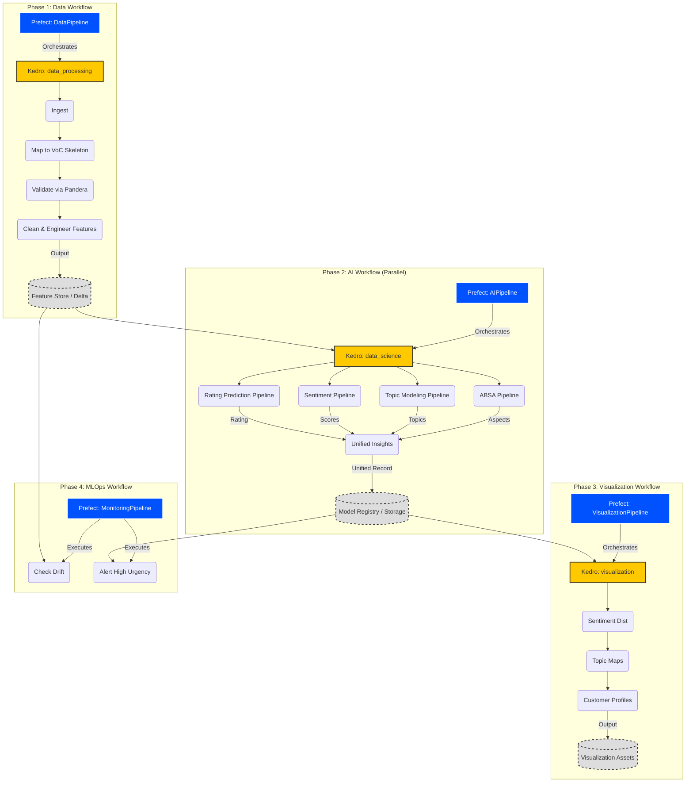

# Technical Design Document

**AI Core:** `Voice of Customer AI`  
**Industry:** `Retail & CPG`  
**Version:** `1.0.0`  
**Last Updated:** `2026-01-22`  
**Author:** `AI Cores Team`

---

## 1. System Architecture Overview

### 1.1 High-Level Architecture

```
┌─────────────────────────────────────────────────────────────────────┐
│                         PRESENTATION LAYER                           │
│  ┌──────────────────────────────────────────────────────────────┐  │
│  │  Streamlit Dashboard (app/)                                   │  │
│  │  - Executive KPIs  - Interactive Visualizations               │  │
│  │  - Customer Profiles - Sentiment & Topic Trends               │  │
│  └──────────────────────────────────────────────────────────────┘  │
└─────────────────────────────────────────────────────────────────────┘
                                    ▼
┌─────────────────────────────────────────────────────────────────────┐
│                      ORCHESTRATION LAYER                             │
│  ┌──────────────────────────────────────────────────────────────┐  │
│  │  Prefect Workflows (src/prefect_orchestration/)               │  │
│  │  - Scheduled Flows  - Error Handling  - Retry Logic           │  │
│  │  - Task Monitoring  - Concurrency Control                     │  │
│  └──────────────────────────────────────────────────────────────┘  │
└─────────────────────────────────────────────────────────────────────┘
                                    ▼
┌─────────────────────────────────────────────────────────────────────┐
│                      TRANSFORMATION LAYER                            │
│  ┌──────────────────────────────────────────────────────────────┐  │
│  │  Kedro Pipelines (src/ai_core/pipelines/)                     │  │
│  │                                                                │  │
│  │  ┌─────────────────┐  ┌───────────────────────────────────┐ │  │
│  │  │ Data Processing │→ │ Data Science (Parallel Models)    │ │  │
│  │  │  - Ingestion    │  │  - ABSA (DeBERTa)                 │ │  │
│  │  │  - Validation   │  │  - Topic Modeling (BERTopic)      │ │  │
│  │  │  - Features     │  │  - Sentiment (DistilRoBERTa)      │ │  │
│  │  └─────────────────┘  │  - Rating Pred (SentenceTransf)   │ │  │
│  │                       └────────────────┬──────────────────┘ │  │
│  │                                        ▼                    │  │
│  │                       ┌───────────────────────────────────┐ │  │
│  │                       │ Unified Insights & Visualization  │ │  │
│  │                       └───────────────────────────────────┘ │  │
│  └──────────────────────────────────────────────────────────────┘  │
└─────────────────────────────────────────────────────────────────────┘
                                    ▼
┌─────────────────────────────────────────────────────────────────────┐
│                         DATA & STORAGE LAYER                         │
│  ┌──────────────────────────────────────────────────────────────┐  │
│  │  Feature Store (Feast)  │  Model Registry (MLflow)            │  │
│  │  Data Catalog (Kedro)   │  Object Storage (S3/Local)          │  │
│  └──────────────────────────────────────────────────────────────┘  │
└─────────────────────────────────────────────────────────────────────┘
```

### 1.2 Technology Stack

| Layer | Technology | Purpose |
|-------|-----------|---------|
| **Presentation** | Streamlit | Interactive dashboards and business user interface |
| **Orchestration** | Prefect 2.x/3.x | Workflow scheduling, monitoring, and error handling |
| **Transformation** | Kedro 0.19+ | Data pipeline framework and reproducibility |
| **Feature Store** | Feast 0.38+ | Feature versioning and serving |
| **Model Registry** | MLflow | Model versioning, tracking, and deployment |
| **ML Frameworks** | Hugging Face Transformers, BERTopic, Scikit-learn | ABSA, Topic Modeling, Sentiment Analysis |
| **Data Processing** | Polars, Pandas | High-performance data manipulation |
| **Validation** | Pydantic, Pandera | Data and schema validation |

---

## 2. Key Architectural Decisions

### 2.1 Decision: Hybrid Kedro + Prefect Architecture

**Context:** Need for both reproducible data pipelines and robust workflow orchestration.

**Decision:** Use Kedro for pipeline logic and Prefect for scheduling/orchestration.

**Rationale:**
- **Kedro** provides:
  - DataCatalog pattern (single source of truth for I/O)
  - Modular pipeline structure
  - Configuration management (base/local)
  - Reproducibility and testability
  
- **Prefect** provides:
  - Distributed task execution
  - Retry logic and error handling
  - Observability and monitoring
  - Dynamic workflow generation

**Consequences:**
- ✅ Best-in-class pipeline development experience
- ✅ Production-grade orchestration capabilities
- ⚠️ Must follow "Pickling Rule": Never pass KedroContext/DataCatalog between Prefect tasks
- ⚠️ Initialize ephemeral KedroSession inside each Prefect task

**Implementation Pattern:**
```python
from prefect import task, flow
from kedro.framework.session import KedroSession

@task(retries=3, retry_delay_seconds=60)
def run_kedro_pipeline_task(pipeline_name: str):
    """Execute Kedro pipeline within Prefect task."""
    with KedroSession.create(project_path=".") as session:
        session.run(pipeline_name=pipeline_name)

@flow
def main_workflow():
    run_kedro_pipeline_task("data_processing")
    run_kedro_pipeline_task("data_science")
```

---

### 2.2 Decision: Feast for Feature Store

**Context:** Need for versioned, reproducible feature engineering with online/offline serving.

**Decision:** Integrate Feast as the feature store, materialized from final Kedro data processing nodes.

**Rationale:**
- Time-travel capabilities for point-in-time correct features
- Unified offline (training) and online (inference) feature serving
- Native integration with Polars and Delta Lake
- Open-source and cloud-agnostic

**Consequences:**
- ✅ Reproducible feature engineering
- ✅ Prevents train-serve skew
- ⚠️ Requires `feature_repo/` structure per AI Core
- ⚠️ Must materialize features from Kedro pipeline outputs

**Integration Point:**
```python
# Final node in data_processing pipeline
def materialize_to_feast(features_df: pl.DataFrame) -> None:
    """Write features to Feast feature store."""
    # Implementation in src/aicore/pipelines/data_processing/nodes.py
```

---

### 2.3 Decision: Strict Type Safety

**Context:** Need for maintainable, self-documenting code in production ML systems.

**Decision:** Mandatory type hints for all function signatures and Pydantic models for configuration.

**Rationale:**
- Early error detection during development
- Self-documenting code
- Better IDE support and autocomplete
- Easier onboarding for new team members

**Consequences:**
- ✅ Fewer runtime errors
- ✅ Better code quality
- ⚠️ Slightly more verbose code
- ⚠️ Requires team training on typing module

**Standard:**
```python
from typing import List, Dict, Optional
import polars as pl

def engineer_features(
    raw_data: pl.DataFrame,
    lookback_days: int = 90
) -> pl.DataFrame:
    """Engineer temporal features from raw data.
    
    Args:
        raw_data: Raw event data with required schema
        lookback_days: Historical window for feature calculation
        
    Returns:
        Feature DataFrame with engineered columns
    """
    # Implementation
```

---

### 2.4 Decision: Configuration-Driven Development

**Context:** Need to support multiple environments (dev, staging, prod) and prevent credential leaks.

**Decision:** Use Kedro's conf/base and conf/local pattern with strict .gitignore rules.

**Rationale:**
- Separation of defaults (base) and secrets (local)
- Environment-specific overrides
- Single source of truth for all configurations
- Built-in Kedro support

**Consequences:**
- ✅ No hardcoded credentials in code
- ✅ Easy environment switching
- ⚠️ Must educate team on base vs. local
- ⚠️ conf/local/ must be in .gitignore

**Structure:**
```
conf/
├── base/
│   ├── catalog.yml       # Data sources (no credentials)
│   ├── parameters.yml    # Model hyperparameters
│   └── logging.yml       # Logging configuration
└── local/
    ├── credentials.yml   # API keys, DB passwords (GITIGNORED)
    └── mlflow.yml        # MLflow tracking URI (GITIGNORED)
```

---

### 2.5 Decision: Multi-Model Ensemble Strategy

**Context:** `Retail & CPG` feedback is complex; a single sentiment score is insufficient.

**Decision:** Implement a composable architecture with specialized NLP models acting in parallel.

**Rationale:**
- Decomposes feedback into actionable components (What aspect? What sentiment? What specific topic?).
- Allows targeted operational responses (e.g., "Fix Shipping" vs. "Improve Product Quality").
- Handles data gaps (e.g., predicting ratings when missing).

**Consequences:**
- ✅ Richer insights than standard sentiment analysis.
- ✅ Modular upgrades (can upgrade Topic Model independently of Sentiment Model).
- ⚠️ Higher computational resource requirements (multiple Transformer models).

**Model Stack:**
1.  **Aspect-Based Sentiment Analysis (ABSA):**
    -   *Model:* `yangheng/deberta-v3-base-absa-v1.1` (DeBERTa)
    -   *Purpose:* Extract aspects (Price, Quality) and score them individually.
2.  **Topic Modeling:**
    -   *Model:* `BERTopic` (UMAP + HDBSCAN + c-TF-IDF)
    -   *Labeling:* Local SLM (Phi-3) or Keyword-based.
    -   *Purpose:* Unsupervised discovery of emerging themes.
3.  **Multimodal Emotion Recognition (MER):**
    -   *Model:* `j-hartmann/emotion-english-distilroberta-base`
    -   *Purpose:* Detect granular emotions (Anger, Joy, Fear) for urgency flagging.
4.  **Rating Prediction:**
    -   *Model:* `SentenceTransformer` (BGE) + `RandomForestClassifier`.
    -   *Purpose:* Impute missing star ratings based on review text.

---

### 2.6 Hybrid Architecture Implementation Details

This section provides detailed implementation guidance for the Prefect + Kedro hybrid architecture.

#### **Project Structure**

The AI Core follows a hybrid structure that separates orchestration concerns from pipeline logic:

```
voice-of-customer/
├── src/
│   ├── prefect_orchestration/     # Prefect flows that orchestrate Kedro pipelines
│   │   ├── data_pipeline.py       # Data processing workflow
│   │   ├── ai_pipeline.py         # Model training workflow
│   │   ├── visualization_pipeline.py  # Reporting workflow
│   │   ├── monitoring_pipeline.py # Drift detection workflow
│   │   └── run_all_pipelines.py   # Master orchestration flow
│   ├── core/                      # Base classes for pipeline architecture
│   │   └── kedro_pipeline.py      # KedroPipeline base class
│   ├── ai_core/                   # Kedro project source code
│   │   ├── pipelines/             # Pipeline modules
│   │   │   ├── data_processing/
│   │   │   ├── data_science/
│   │   │   │   ├── absa/          # Aspect-Based Sentiment Analysis
│   │   │   │   ├── mer/           # Multimodal Emotion Recognition
│   │   │   │   ├── rating_prediction/
│   │   │   │   ├── sentiment_analysis/
│   │   │   │   ├── topic_modeling/
│   │   │   │   └── unified_insights/
│   │   │   ├── visualization/
│   │   │   └── monitoring/
│   │   ├── datasets/              # Custom Kedro datasets
│   │   │   ├── polars_delta_dataset.py
│   │   │   └── cloudpickle_dataset.py
│   │   └── pipeline_registry.py   # Pipeline registration
│   └── utils/                     # Shared utilities
│       └── mlflow_tracking.py     # MLflow integration
├── conf/                          # Kedro configuration
│   ├── base/                      # Default configuration
│   │   ├── catalog.yml            # Data sources and destinations
│   │   ├── parameters.yml         # Pipeline parameters
│   │   └── logging.yml            # Logging configuration
│   └── local/                     # Local overrides (gitignored)
├── configs/                       # Prefect orchestration configuration
├── data/                          # Data storage (layered)
│   ├── 01_raw/                    # Raw input data
│   ├── 02_intermediate/           # Intermediate processing
│   ├── 03_primary/                # Cleaned data
│   ├── 04_feature/                # Engineered features
│   └── 05_model_input/            # Model-ready datasets
├── feature_repo/                  # Feast feature store
│   ├── feature_store.yaml         # Feast configuration
│   ├── entities.py                # Entity definitions
│   └── features.py                # FeatureView definitions
└── app/                           # Streamlit applications
    └── app.py                     # Main dashboard
```

---

#### **Standardized Datasets**

The template includes specialized Kedro datasets in `src/ai_core/datasets/` for high-performance data I/O:

**1. PolarsDeltaDataset**

Handles "PurePosixPath" compatibility for Delta Lake, ensuring seamless integration between Polars and Delta tables.

```python
# Usage in catalog.yml
features_delta:
  type: ai_core.datasets.polars_delta_dataset.PolarsDeltaDataset
  filepath: data/04_feature/features.delta
  write_mode: overwrite
  delta_write_options:
    schema_mode: overwrite
```

**Key Features:**
- Native Polars DataFrame support
- Delta Lake ACID transactions
- Schema evolution support
- Time-travel capabilities

**2. CloudPickleDataset**

Serializes complex ML models (like BERTopic or custom PyTorch models) that standard pickle cannot handle due to complex dependencies or lambda functions.

```python
# Usage in catalog.yml
topic_model:
  type: ai_core.datasets.cloudpickle_dataset.CloudPickleDataset
  filepath: data/06_models/topic_model.pkl
```

**Key Features:**
- Handles lambda functions and closures
- Supports complex nested objects
- Compatible with BERTopic and Hugging Face models
- Preserves model state and hyperparameters

---

#### **Detailed System Architecture**

The following Mermaid diagram illustrates the four-phase workflow orchestration:



**Workflow Phases:**

1. **Phase 1 - Data Workflow:**
   - Ingests raw data from multiple sources.
   - Maps to "VoC Skeleton" schema.
   - Validates data quality using Pandera schemas.
   - Engineers features and materializes to Feast/Delta.

2. **Phase 2 - AI Workflow:**
   - Runs parallel NLP models (ABSA, Topic, Sentiment, Rating).
   - Merges outputs into a "Unified Interaction Record".
   - Registers models to MLflow.

3. **Phase 3 - Visualization Workflow:**
   - Generates distribution plots, heatmaps, and word clouds.
   - Aggregates customer profiles.
   - Exports assets for Streamlit dashboard.

4. **Phase 4 - MLOps Workflow:**
   - Monitors for feature drift (Sentiment Drift).
   - Detects high urgency interactions for alerting.
   - Logs metrics to MLflow.

---

#### **Configuration & Extension**

The project uses a clear separation of concerns for configuration:

**Configuration Files:**

| File | Purpose | Scope |
|------|---------|-------|
| `configs/project_config.yaml` | Prefect orchestration settings, deployments, work pools, logging | Orchestration |
| `conf/base/catalog.yml` | Dataset definitions (inputs, outputs, models) | Data I/O |
| `conf/base/parameters.yml` | Pipeline parameters, model hyperparameters, MLflow settings | Pipeline Logic |
| `conf/base/logging.yml` | Kedro logging configuration | Observability |
| `conf/local/credentials.yml` | API keys, database passwords, cloud credentials (gitignored) | Secrets |
| `conf/local/mlflow.yml` | MLflow tracking URI, experiment names (gitignored) | MLflow Config |

---

#### **Feast Feature Store Integration**

This AI Core integrates with **Feast** for feature management. The `data_processing` pipeline's final node registers features to Feast, making them available for downstream models.

**Feature Store Structure:**

```
feature_repo/
├── feature_store.yaml   # Feast configuration (offline/online stores)
├── entities.py          # Entity definitions (e.g., customer_id, subscriber_id)
└── features.py          # FeatureView definitions (feature schemas and sources)
```

---

## 3. Data Flow Diagram

```
┌─────────────┐
│ Raw Sources │
│ (S3/API/DB) │
└──────┬──────┘
       │
       ▼
┌─────────────────────────────────────────────┐
│ Data Processing Pipeline                    │
│ ┌─────────────────────────────────────────┐ │
│ │ 1. Ingest & Validate (Pandera schemas)  │ │
│ │ 2. Clean & Standardize                  │ │
│ │ 3. Engineer Features (RFM, QoE, etc.)   │ │
│ │ 4. Materialize to Feast Feature Store   │ │
│ └─────────────────────────────────────────┘ │
└──────┬──────────────────────────────────────┘
       │
       ▼
┌─────────────────────────────────────────────┐
│ Data Science Pipeline                       │
│ ┌─────────────────────────────────────────┐ │
│ │ 1. Load Features from Feast             │ │
│ │ 2. Train/Validate Models                │ │
│ │ 3. Generate Predictions                 │ │
│ │ 4. Compute Explainability (SHAP/LIME)   │ │
│ │ 5. Register Models to MLflow            │ │
│ └─────────────────────────────────────────┘ │
└──────┬──────────────────────────────────────┘
       │
       ▼
┌─────────────────────────────────────────────┐
│ Visualization Pipeline                      │
│ ┌─────────────────────────────────────────┐ │
│ │ 1. Aggregate Metrics                    │ │
│ │ 2. Generate Reports                     │ │
│ │ 3. Export to Dashboard Data Store       │ │
│ └─────────────────────────────────────────┘ │
└──────┬──────────────────────────────────────┘
       │
       ▼
┌─────────────────┐
│ Streamlit App   │
│ (Business Users)│
└─────────────────┘
```

---

## 4. Security & Compliance

### 4.1 PII Handling
- **Detection:** Automatic PII detection (Names, Emails) using regex/Presidio.
- **Masking:** De-identification before feature engineering.
- **Storage:** PII never enters training datasets or feature store.

### 4.2 Secrets Management
- All credentials in `conf/local/credentials.yml` (gitignored).
- Use Prefect Blocks for production secret injection.
- No hardcoded API keys or passwords in code.

### 4.3 Data Governance
- All datasets versioned in DataCatalog.
- Audit trail via MLflow experiment tracking.
- Reproducible pipelines with fixed random seeds.

---

## 5. Performance & Scalability

### 5.1 Optimization Strategies
- **Polars Integration:** All data processing uses Polars for multithreaded performance and lazy evaluation.
- **Caching:** Streamlit `@st.cache_resource` for loading heavy Transformer models, `@st.cache_data` for DataFrames.
- **Batching:** Prefect task mapping for parallel processing of large review batches.
- **Hardware Acceleration:** GPU support for deep learning models (CUDA/MPS/SYCL) via PyTorch.

### 5.2 Scalability Targets
- **Data Volume:** Capable of processing 1M+ reviews/day.
- **Inference Latency:** < 200ms per record for real-time analysis.
- **Concurrent Users:** 50+ dashboard users.

---

## 6. Monitoring & Observability

### 6.1 Pipeline Monitoring
- **Prefect UI:** Workflow execution status, task retries, failures.
- **MLflow:** Model performance metrics, experiment tracking.
- **Logging:** Centralized logging via Python `logging` module.

### 6.2 Model Monitoring
- **Drift Detection:** `monitoring` pipeline checks for sentiment drift (e.g., sudden increase in negative reviews).
- **Topic Stability:** Monitoring for emergence of new topics or shifts in topic distribution.
- **Alerting:** Prefect notifications and Slack alerts on pipeline failures or critical drift.

---

## 7. Deployment Topology

```
Development Environment:
- Local Kedro execution
- Local MLflow server
- Streamlit dev server
- Local Delta Lake (via custom PolarsDeltaDataset)

Production Environment:
- Prefect Cloud/Server for orchestration
- MLflow on dedicated server/cloud
- Streamlit deployed via Docker/Cloud Run
- Feature Store: Feast with cloud backend (S3/Azure Blob)
- Compute: GPU-enabled workers for NLP pipelines
```

---

## 8. Future Enhancements

1. **Real-Time Inference:** Implement online feature serving via Feast and a FastAPI wrapper for `unified_insights`.
2. **Video Analysis:** Enable the `mer` pipeline to process video/audio files (requires `opencv` and `facenet`).
3.  **AutoML Integration:** Automated hyperparameter tuning for the Rating Prediction model.
4. **A/B Testing Framework:** Model comparison in production.
5. **Advanced Explainability:** Counterfactual explanations for sentiment scores.

---

**Document Control:**
- **Review Cycle:** Quarterly
- **Approval Required:** Tech Lead, MLOps Architect
- **Related Documents:** `api_specification.md`, `runbook.md`, `user_guide.md`